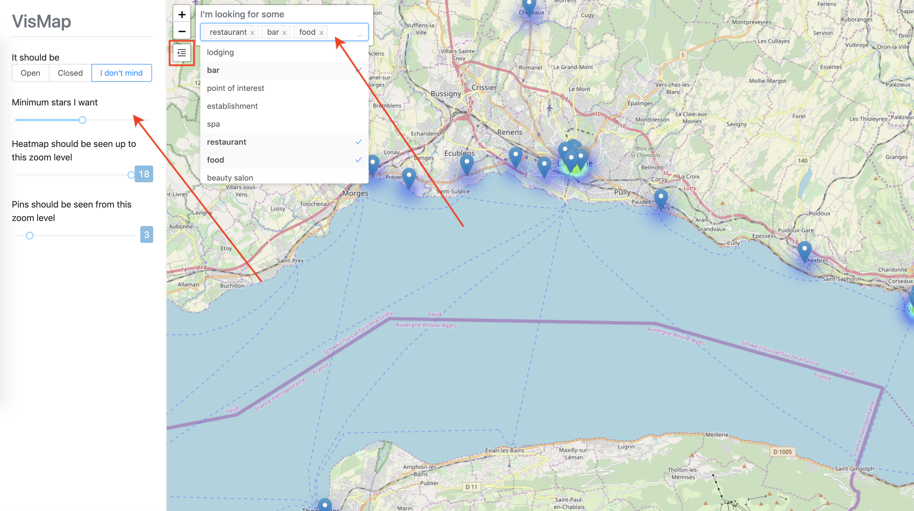

# Vismap

## Idées retouches
- couleurs de marqueurs
  - vert - orange - rouge(ouvert - aucune information - fermé)
  - Ajouter de la transparence pour les marqueurs fermés
- Afficher les marqueurs si peu d'établissement plutôt que par niveau de zoom et inversement
- Jouer sur la couleur aussi sur les couleurs pour le heatmap
- Corriger bug chargement d'affichage
- Enlever la visualisation des établissements fermés uniquement
- Afficher les établissements sans informations quand on filtre par établissement ouvert

## Contexte
Avec des transports de plus en plus nombreux et de moins en moins chers, le tourisme est en pleine expansion. De nombreuses régions basent leur économie sur le tourisme.

Cependant avec l'explosion d'offres, il est compliqué pour un touriste de savoir où aller et quoi chercher. Certains préfèrent se fier aux comparatifs offerts par des sites comme Trivago, mais d'autres préfèrent se balader et se fier à leurs envies.

Le problème étant que pour ces derniers, il peut être difficile de savoir où se promener.

## Objectif
Le but de se promener et de mettre en évidence des zones d'intérêts au niveau d'une ville ou d'une partie d'une ville.

Dans de nombreuses villes touristiques, des quartiers de magasins et de restaurants se forment. L'idée est de profiter de ces regroupements d'établissements pour définir des zones d'intérêts en fonction du nombre d'établissement, de leur prix et de leur note.

## Sources de données
L'application peut récupérer les données grâce à l'API Google Maps qui fournit les établissements près d'un point géographique. Ainsi les données sont intégrées et mises à jour par les utilisateurs eux-mêmes.

Cependant, en phase de développement, nous travaillons en local et il n'est donc pas possible de whitelister l'adresse du site web. Hors l'API refuse les requêtes d'adresses non-whitelistées. Ainsi nous avons téléchargé en local un jeu de données.

Pour que l'application utilise une API, il suffit d'aller dans le fichier (...) et de décommenté la ligne :

## Visualisation
Le site affiche une carte de la région avec les points d'intérêts. S'il y a peu de points d'intérêts, ils seront affichés à l'aide d'un marqueur pour plus de précision. Si, au contraire, il y en a beaucoup, l'affichage d'une heatmap est privilégiée afin de mieux visualiser la différence de quantité d'établissement dans les régions.


### Interactivité
Des widgets constamment visibles ont été mis en place pour les interactions les plus usités :
- Filtre par type d'établissement
- Zoom / dézoon

Un bouton est intégré pour afficher un menu pour les interactions secondaires :
- Filtre par ouverture
- Filtre par niveau d'étoile
- Affichage par heatmap
- Affichage par marqueur


#### Filtres

##### Type d'établissement
Si le touriste souhaite plutôt manger, il peut filtrer par type d'établissement à l'aide de mots-clés tels que : restaurant, bar, etc. 

##### Ouverture
Si le touriste recherche un établissement dans l'immédiat, il peut filtrer pour n'afficher que ceux qui sont ouverts.

Les marqueurs d'une couleur verte indiquent que l'établissement est ouvert, le rouge, fermé et l'orange, pour ceux dont nous n'avons pas l'information.

##### Niveau d'étoiles
Dans Google, les utilisateurs peuvent évaluer les établissements avec des étoiles allant de 0 à 5. Il est ainsi possible pour le touriste de pouvoir filtrer la liste des établissements pour s'orienter vers des quartiers sûrs avec de bons établissements.

#### Zoom
Le touriste peut adapter la taille de la région qu'il recherche en fonction de son moyen de locomotion grâce à une fonction de zoom / dézoom.

Suivant les habitudes des utilisateurs, il est possible de le faire à l'aide du scroll et de l'écartement de doigt sur le touchpad. Pour un utilisateur peu habitué à l'informatique de classiques boutons "+" et "-" ont été intégrés.

#### Affichage heatmap
Si le niveau de zoom est faible et les établissements rapprochés, il est vite compliqué d'analyser la distance réelle entre les marqueurs et leur nombre et, par conséquent, d'évaluer si un quartier contient de nombreux établissements.

Dans ce cas une heatmap est privilégiée, afin de highlighté les quartiers intéressant avec une échelle d'intensité.

Cependant si le niveau de zoom est élevé, les établissements sont éloignés et apparaît une zone de chaleur pour chaque établissement ce qui n'indique plus aucune information.

Le touriste peut donc définir jusqu'à quel niveau de zoom la heatmap est affiché en fonction du nombre d'établissement.

#### Affichage marqueur
Comme, lorsque le niveau de zoom est élevé, les établissements sont relativés éloignés et bien distincts sur la carte. Un permet de définir la position individuellement des établissements. Le touriste est capable d'analyser la zone où les établissements sont les plus rapprochés à l'oeil nu.

Cependant, si le niveau de zoom est faible, les établissements sont rapprochés, il n'est plus possible d'évaluer leur distance, ni leur nombre dans certains cas.

Le touriste peut donc définir à partir de quel niveau de zoom les marqueurs sont affichés en fonction du nombre d'établissements.

### Déploiement en local
```
npm install
```

#### Compiles and hot-reloads for development
```
npm run serve
```

#### Compiles and minifies for production
```
npm run build
```

#### Run your tests
```
npm run test
```

#### Lints and fixes files
```
npm run lint
```

#### Customize configuration
See [Configuration Reference](https://cli.vuejs.org/config/).
